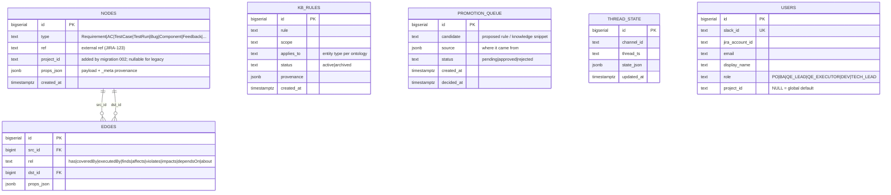

# Database Schema — Tieu Kiwi (Postgres graph + Chroma RAG)

## Tổng quan

Tieu Kiwi lưu **2 tầng bộ nhớ**:

- **Tầng 1 — RAG (Chroma)**: index của `skills/*.md` + `kb/*.md`, embed nội bộ bằng `all-MiniLM-L6-v2` (384 dim). Kho vector external (không nằm trong Postgres).
- **Tầng 2 — Knowledge Graph (Postgres)**: `nodes`/`edges` mô hình hoá vòng đời QE. Kèm bảng phụ `kb_rules` (rule đã curator duyệt), `promotion_queue` (candidate chờ duyệt), `thread_state` (Layer C memory per-thread).

Ngoài ra:
- **`users`** (thêm qua migration `002`): mapping Slack ↔ Jira ↔ email, dùng cho ask routing.
- **`nodes.project_id`** (thêm qua migration `002`): hỗ trợ multi-project + cross-project edges.

## ERD (Mermaid)



## Bảng độc lập, không FK

- `users` liên kết mềm với `nodes` qua `nodes.props_json.owner_slack_id` (instance override).
- `kb_rules` liên kết mềm với `nodes` qua cột `applies_to` (khớp `nodes.type` khi curator viết rule).
- `promotion_queue` không FK — candidate rule tồn tại độc lập, khi approve mới INSERT vào `kb_rules`.
- `thread_state` không FK — key logic là `(channel_id, thread_ts)`.
- **Chroma** hoàn toàn ngoài Postgres — cầu nối là `applies_to` metadata trên document trong Chroma.

## Cross-project semantics

Sau migration `002_migration.sql`:

- `nodes.project_id` nullable (legacy rows = NULL). Ingest mới nên set project code (VD `PROJ_AUTH`).
- `edges` **không có `project_id`** — cạnh cross-project được phép:
  - `Requirement[PROJ_AUTH] --impacts--> Component[PROJ_NOTIF]`
  - `Component[PROJ_AUTH] --dependsOn--> Component[PROJ_NOTIF]`
- Query filter theo project ở caller site (JOIN qua `nodes.project_id` của src/dst).

⚠️ **Note**: 3 query đinh hiện tại (`coverage_gap`, `trace`, `bug_blast_radius`) **chưa filter theo `project_id`**. Trong hackathon 1-project OK. Future work: add optional `project_id` param.

## Convention `props_json._meta` (LLM extraction)

Node do LLM extract phải có sub-object `_meta`:

```json
{
  "detail": "...",
  "_meta": {
    "extraction_source": "llm:claude-sonnet-4-6",
    "confidence": 0.87,
    "source_file": "requirements/BRD-login.pdf",
    "source_chunk": 12,
    "review_status": "draft"
  }
}
```

Node do human tạo (Excel import, manual): `_meta.extraction_source: "human"` hoặc `"excel-import"`. Không có `_meta` = mặc định human, confidence = 1.0.

## Indexes (chỉ liệt kê những cái quan trọng)

Team schema hiện chưa có indexes tường minh (chỉ có PK/FK indexes ngầm định). Đề xuất add khi tối ưu:

```sql
CREATE INDEX idx_nodes_type ON nodes (type);
CREATE INDEX idx_nodes_project_type ON nodes (project_id, type);
CREATE INDEX idx_nodes_props ON nodes USING GIN (props_json);
CREATE INDEX idx_edges_src_rel ON edges (src_id, rel);
CREATE INDEX idx_edges_dst_rel ON edges (dst_id, rel);
CREATE INDEX idx_kb_applies ON kb_rules (applies_to) WHERE status = 'active';
CREATE INDEX idx_users_role_project ON users (role, project_id);
```
