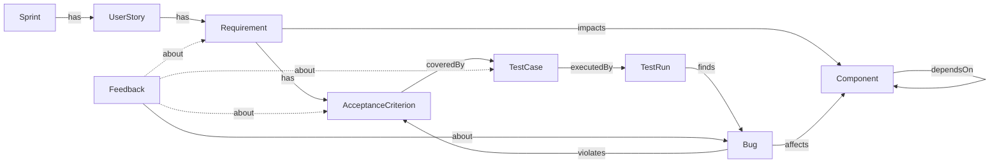

# Tieu Kiwi — Ontology (paste vào doc thiết kế)

## Node types (9)

| Node | Ref example | Vai trò |
|---|---|---|
| **Sprint** | `SPR-24` | Kỳ phát triển |
| **UserStory** | `US-101` | Tính năng lớn thuộc Sprint |
| **Requirement** | `REQ-101-1` | Yêu cầu nghiệp vụ chi tiết |
| **AcceptanceCriterion** | `AC-101-1` | Tiêu chí nghiệm thu, căn cứ viết testcase |
| **TestCase** | `TC-101-A` | Kịch bản kiểm thử |
| **TestRun** | `RUN-101-A-1` | Lần chạy testcase |
| **Bug** | `BUG-501` | Lỗi phát sinh |
| **Component** | `COMP-AUTH` | Module kỹ thuật |
| **Feedback** | `FB-001` | Nhận xét về artifact, ứng viên rule |

## Relations (9)

| Src → Dst | Relation | Ngữ nghĩa |
|---|---|---|
| Sprint → UserStory | `has` | Sprint chứa story |
| UserStory → Requirement | `has` | Story phân rã thành requirement |
| Requirement → AcceptanceCriterion | `has` | Requirement gồm các AC |
| Requirement → Component | `impacts` | Requirement tác động component nào |
| AC → TestCase | `coveredBy` | AC được cover bởi testcase (thiếu → coverage_gap) |
| TestCase → TestRun | `executedBy` | Testcase được chạy trong run |
| TestRun → Bug | `finds` | Run phát hiện bug |
| Bug → Component | `affects` | Bug ảnh hưởng component |
| Bug → AC | `violates` | Bug vi phạm AC → block golive |
| Component → Component | `dependsOn` | Phụ thuộc, có thể **cross-project** |
| Feedback → (Bug\|Req\|TC\|AC) | `about` | Feedback về artifact nào |

## Mermaid diagram

## Ask Routing Map (entity → owner role)

| Entity | Owner role | Slack channel/user (VD) |
|---|---|---|
| Sprint / UserStory / Requirement | **PO** | @po-anh |
| AcceptanceCriterion | **PO** | @ba-binh |
| TestCase | **QE_LEAD** | @qe-cuong |
| TestRun | **QE_EXECUTOR** | @qe-dung |
| Bug | **DEV** (assignee của bug) | @dev-em |
| Component | **TECH_LEAD** | @tl-fong / @tl-giang |
| Feedback | Theo entity mà Feedback about | (hop qua edge `about`) |

Fallback khi resolve owner (`kiwi_core/routing.py`):
1. `node.props_json.owner_slack_id` (instance override)
2. `users WHERE project_id = X AND role = <default>`
3. `users WHERE project_id IS NULL AND role = <default>`
4. Log unresolved → hỏi curator bổ sung mapping

## Cross-project semantics

- `edges` **không có `project_id`** — cạnh cross-project được phép.
- Filter theo project ở query time qua `nodes.project_id` của src/dst.
- 2 ví dụ trong seed:
  - `Requirement[PROJ_AUTH] --impacts--> Component[PROJ_NOTIF]`
  - `Component[PROJ_AUTH] --dependsOn--> Component[PROJ_NOTIF]`
