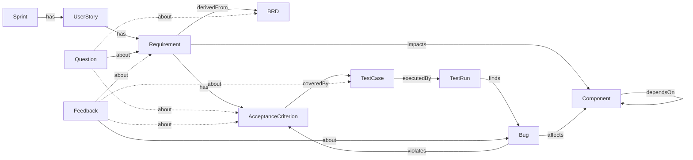

# Tieu Kiwi — Ontology (paste vào doc thiết kế)

## Node types (11)

| Node | Ref example | Vai trò |
|---|---|---|
| **Sprint** | `SPR-24` | Kỳ phát triển |
| **UserStory** | `CDM-275` / `US-101` | Story lớn (Jira Epic hoặc UserStory) chứa nhiều Requirement |
| **Requirement** | `CDM-268` / `REQ-101-1` | Yêu cầu nghiệp vụ (thường tương ứng 1 Jira Story) |
| **BRD** | `CFL-2541551769` | Business Requirement Document — Confluence page nguồn. Chỉ giữ metadata + preview trong Postgres; content chunks index ở Chroma. |
| **AcceptanceCriterion** | `AC-CDM-268-a3f9c2e1` | Tiêu chí nghiệm thu, ref = `AC-<req_key>-<hash8>` (hash 8 hex của desc — idempotent qua re-ingest, text đổi → node mới + node cũ mark obsolete, giữ history `Bug -violates-> AC` |
| **TestCase** | `CDM_DupScript_002` / `TC-101-A` | Kịch bản kiểm thử |
| **TestRun** | `CDM-270` / `RUN-101-A-1` | Lần chạy testcase (có thể tương ứng 1 Jira subtask test-env) |
| **Bug** | `CDM-286-1` / `BUG-501` | Lỗi phát sinh (1 row của bảng markdown trong `[Bug]` subtask → 1 Bug node) |
| **Component** | `COMP-CDM-REVIEWER` / `COMP-AUTH` | Module kỹ thuật |
| **Question** | `Q-<thread_ts>-<idx>` | Câu hỏi agent hỏi PO/DEV trong Slack thread; `props.status = open/answered/resolved` |
| **Feedback** | `FB-001` | Nhận xét về artifact, ứng viên rule (Layer C promotion) |

## Relations (12)

| Src → Dst | Relation | Ngữ nghĩa |
|---|---|---|
| Sprint → UserStory | `has` | Sprint chứa story |
| UserStory → Requirement | `has` | Story phân rã thành requirement |
| Requirement → BRD | `derivedFrom` | Requirement phái sinh từ BRD nào (edge `props.section_anchor` chỉ vào section cụ thể) |
| Requirement → AcceptanceCriterion | `has` | Requirement gồm các AC |
| Requirement → Component | `impacts` | Requirement tác động component nào |
| AC → TestCase | `coveredBy` | AC được cover bởi testcase (thiếu → coverage_gap) |
| TestCase → TestRun | `executedBy` | Testcase được chạy trong run |
| TestRun → Bug | `finds` | Run phát hiện bug (find_by=Testcase) |
| Bug → Component | `affects` | Bug ảnh hưởng component |
| Bug → AC | `violates` | Bug vi phạm AC → block golive |
| Component → Component | `dependsOn` | Phụ thuộc, có thể **cross-project** |
| Question → (Requirement\|BRD\|AC) | `about` | Câu hỏi agent hỏi PO về artifact nào |
| Feedback → (Bug\|Req\|TC\|AC) | `about` | Feedback về artifact nào |

## Mermaid diagram



## `BRD` node convention (Confluence source)

- `ref` format: `CFL-<page_id>` (VD `CFL-2541551769`)
- Key props:
  - `url` — full Confluence URL kèm section fragment
  - `page_id` — Confluence numeric ID (để lookup ngược)
  - `space` — Confluence space key (VD `tech`)
  - `section_anchor` — slug URL fragment (VD `15.-Assign-new-creator-...`)
  - `section_title` — human-readable section (VD `"15. Assign new creator for a booking script"`)
  - `version`, `last_modified`, `content_hash` — versioning
  - `content_preview` — first ~500 chars (full content ở Chroma)
- BRD content được chunk index vào Chroma với metadata `{doc_type: "BRD", page_id, section, section_anchor, project_id}`.
- Edge `Requirement -derivedFrom-> BRD` có `props.section_anchor` để agent scope đúng section khi RAG.

## `AcceptanceCriterion` node convention (LLM extraction from PRD)

- `ref` format: `AC-<req_key>-<hash8>` (VD `AC-CDM-268-a3f9c2e1`)
  - `hash8` = sha256 của `desc` (whitespace-normalised), 8 hex đầu.
  - Cùng desc → cùng ref → idempotent upsert.
  - PM sửa text ("Reviewer" → "Reviewers") → hash mới → **tạo AC mới** + AC cũ
    `_meta.review_status='obsolete'`. Edge `Bug -violates-> AC_cũ` được giữ nguyên
    để không mất history của classify_bug.
- Key props:
  - `desc` — nội dung AC (verbatim từ PRD hoặc LLM extract)
  - `section_anchor` — URL fragment (URL-decoded) của section PRD gốc (VD `"15.-Assign-new-creator"`)
  - `section_title` — heading text thực trong PRD (VD `"15. Assign new creator for a booking script"`)
  - `_meta.source_file` — URL Confluence đầy đủ (kèm `#anchor`) để trace về PRD
  - `_meta.review_status` — `draft` (LLM) → `verified` (human OK) → `obsolete` (PM đã sửa/xoá)
  - `_meta.ingested_at` / `_meta.obsoleted_at` — timestamp lifecycle
- Diff logic (2026-07): mỗi lần re-ingest ticket, extract AC từ TẤT CẢ Confluence
  pages trong description → gom vào 1 batch → `_diff_and_upsert_acs` reconcile 1 lần
  (không obsolete AC của page khác như bug cũ). Xem `jira_ingest._diff_and_upsert_acs`.
- Query AC theo feature (để copy ref vào Excel `ac_refs`):
  ```sql
  SELECT ref, props_json->>'desc' FROM nodes
  WHERE type='AcceptanceCriterion' AND project_id='CDM'
    AND props_json->>'section_title' ILIKE '%login%';
  ```

## `Question` node convention (agent-PO clarification)

- `ref` format: `Q-<thread_ts>-<idx>` (thread-scoped, unique)
- Key props:
  - `text` — câu hỏi
  - `asked_by` — "agent" (hoặc user_id)
  - `asked_to` — Slack ID người được tag
  - `thread_ts` — link ngược lên `thread_state`
  - `status` — `open | answered | resolved`
  - `answer` — text reply của PO (khi status=answered)
  - `answered_at` — timestamp
- Vòng đời: agent detect thiếu info khi analyze BRD → create Question → tag PO → PO reply → agent update `answer` + `status`. Nếu answer sinh AC mới, tạo edge `Question -about-> AC`.

## `Bug` từ subtask `[Bug]` (Jira convention — team CDM)

Trong Jira của team, `[Bug]` là subtask container có description dạng **markdown table**, mỗi row là 1 bug riêng biệt:

| Bug | Step | Actual | Expected | Priority | Find by | Status |
|---|---|---|---|---|---|---|

- Ingest: **1 row = 1 Bug node**, ref format `<subtask_key>-<row_idx>` (VD `CDM-286-1..5`)
- Props derived từ columns:
  - `Priority` (High/Medium) → `props.severity`
  - `Status` / marker 🟢 → `props.status` (`done | open | inprogress`)
  - `Find by`:
    - `Testcase` → tạo edge `TestRun -finds-> Bug` (caught_by_test)
    - `Lack` → không tạo `finds` edge (leaked, classify sau)
- Container ref lưu ở `props.jira_container_ref` (VD `"CDM-286"`)
- Parent Story ref lưu ở `props.jira_parent_ref` (VD `"CDM-268"`) — dùng cho `classify_bug` category `leaked_impact_missed`

## Ask Routing Map (entity → owner role)

| Entity | Owner role | Slack channel/user (VD) |
|---|---|---|
| Sprint / UserStory / Requirement | **PO** | @po-anh |
| BRD | **PO** (Confluence author) | @po-anh |
| AcceptanceCriterion | **PO** | @ba-binh |
| TestCase | **QE_LEAD** | @qe-cuong |
| TestRun | **QE_EXECUTOR** | @qe-dung |
| Bug | **DEV** (assignee của bug) | @dev-em |
| Component | **TECH_LEAD** | @tl-fong / @tl-giang |
| Question | **PO** (target của câu hỏi — thường là PO của Requirement) | @po-anh |
| Feedback | Theo entity mà Feedback about | (hop qua edge `about`) |

Fallback khi resolve owner (`tieukiwi/routing.py` + `tieukiwi/db.py::mention_for`):
1. `node.props_json.owner_slack_id` (instance override)
2. `users WHERE project_id = X AND role = <default>`
3. `users WHERE project_id IS NULL AND role = <default>`
4. Log unresolved → hỏi curator bổ sung mapping

## Cross-project semantics

- `edges` **không có `project_id`** — cạnh cross-project được phép.
- Filter theo project ở query time qua `nodes.project_id` của src/dst.
- 2 ví dụ trong seed:
  - `Requirement[PROJ_AUTH] --impacts--> Component[PROJ_NOTIF]`
  - `Component[PROJ_AUTH] --dependsOn--> Component[PROJ_NOTIF]`
